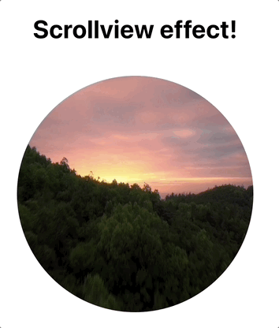

# Scrollview Tutorial

Let's discover **scrollview** created by _Catbow_!

## Getting Started with Scrollview

Scrollview is `easy to use` and an `useful app` that helps moving images by scrolling the webpage.



> **😺🌈 Catbow tips!** <br/>
> Have you got a video that you would like to to make as scrollview effect as above? <br/>
> You can covert your video (less than 30s) to photos **for free** from catbow converter!<br/>
> website : https://catbow.github.io/catbow-photo-converter/

<!--  -->

<a href="https://catbow.github.io/catbow-photo-converter/"></a>
<br/>
<br/>

# Installation

```terminal
$ npm i react-catbow-scrollview
```

You can make a code section and edit setting as below:

```javascript
const option = {
	imgUrl: './images/004/', //  Address before image
	videoImageCount: 754, // Total-number-of-images
	startNum: 10000, // Image-path-start-number
	extension: '.jpg', // Available-with-any-image-extension
	scrollAreaY: 50000, // scrollArea,
	top: 20 // top: 20px
	viewPort: {
		// all-imgTag-styles-available
		width: '500px',
	},
};
// Render
<ScollView option={option} viewItem={<Components />} />;
// viewItem is optional
// you can render Components in ScollView
```

#### ❉❉ The image address path must have consecutive numbers.

<br/>

| option          | discription                                  | type           |
| --------------- | -------------------------------------------- | -------------- |
| imgUrl          | Address before image                         | String         |
| videoImageCount | Total-number-of-images                       | String         |
| startNum        | Image-path-start-number                      | Number         |
| extension       | Available-with-any-image-extension           | String         |
| scrollAreaY     | scrollArea                                   | Number         |
| viewPort?       | img-style                                    | Object         |
| top?            | css style top                                | Number         |
| viewItem?       | Jsx components can be rendered in ScrollVIew | JSX Components |

### How to use viewItem option

#### you can try Components styling,

#### You must use css 'position absolute' at the top of Components

```javascript
// this is components
export default function Hello() {
  return (
    <div style={{ top: "10px", position: "absolute" }}>
      <h1 style={{ fontSize: "5rem" }}>hello world</h1>
      <h1 style={{ marginTop: "600px", fontSize: "5rem" }}>
        React-catbow-ScrollView
      </h1>
    </div>
  );
}
//
function App() {
  const option = {
    videoImageCount: 754,
    imgUrl: "./images/004/",
    startNum: 10000,
    extension: ".jpg",
    scrollAreaY: 4970,
    top: 30,
    viewPort: {
      width: "550px",
      height: "550px",
      margin: "100px 100px",
      borderRadius: "9999px",
    },
  };
  return <ScrollView option={option} viewItem={<Btton />} />;
}
```

<!--  -->

🗂 [Test Img Zip](https://drive.google.com/file/d/1i-CypIWeH-LSh3XjOvFtBMfgiIgxtzfn/view?usp=share_link)

<br/>

#### 👉 [Catbow Github](https://github.com/catbow/react-catbow-scrollview)

> **😺🌈 Catbow tips!** <br/>
> if those names of images are like 'IMG*1', 'IMG_2'....'IMG_100' (because in the example on the top, the image names are composed of numbers only) you should set the option as below. the part of the name `IMG*`should be in`imgUrl`and numbers should be in`startNum`

> please look carefully the option of` imgUrl`, `videoImageCount `& `startNum`

```javascript
const option = {
	imgUrl: './images/004/IMG_', //  Address before image
	videoImageCount: 100, // Total-number-of-images
	startNum: 1, // Image-path-start-number
	extension: '.jpg', // Available-with-any-image-extension
	scrollAreaY: 50000, // scrollArea,
	top: 20 // top: 20px
	viewPort: {
		// all-imgTag-styles-available
		width: '500px',
	},
};
<ScollView option={option} viewItem={<Components />} />;
```

### Detailed explaination

#### 1. Explained with JSDoc for your better understanding


Scrollview supports to show how to set the options in the Code Editor.
You can just hover the cursor on the component!

If you still don't understand certain things, please refer to the options in the README.md on <a href="https://github.com/catbow/react-catbow-scrollview">Github react-catbow-scrollview repository</a>.

#### 2. position: sticky

Scrollview component has the CSS `position: sticky` property because the bunch of images should not disappear from the screen.

Therefore, you should keep the following situations in mind and style them.

a. If it's not set as full screen, you should decorate the surroundings, or it would be showing as below.


when it is set as a full-screen, the result would be:


```javascript
const option = {
  videoImageCount: 754,
  imgUrl: "./004/",
  startNum: 10000,
  extension: ".jpg",
  scrollAreaY: 6000,
  viewPort: {
    width: "100vw",
    height: "100vh",
  },
};
```

B. the scroll area : `ScrollAreaY` increases the playback length.
Each user would have their own desired percentage, so if you increase it to 100 units step by step and test it, you will get your desired percentage.


```javascript
const option = {
  videoImageCount: 754,
  imgUrl: "./004/",
  startNum: 10000,
  extension: ".jpg",
  scrollAreaY: 100000, // It's hard to scroll because it's 100,000.
  viewPort: {
    width: "100vw",
    height: "100vh",
  },
};
```

#### 3. viewPort is `` Tag itself

This is an example of making a circle with border properties.


```javascript
const option = {
  videoImageCount: 754,
  imgUrl: "./004/",
  startNum: 10000,
  extension: ".jpg",
  scrollAreaY: 10000,
  viewPort: {
    //  img tag!!
    width: "500px",
    height: "500px",
    margin: "100px 100px",
    borderRadius: "9999px",
  },
};
```

#### 4. viewItem is a special option to render JSX inside

I thought a lot about this option.
When I made a library, I aimed to make it easy to use, easy to access
This option gives you the option to customize your library
At the same time, I felt compelled to act. (But I did!))

I simply added the phrase "hello" as showing below.


There are only two rules to follow.

1. For the components to be handed over, make sure to put the css position: absolute property at the top.
2. You have to pass it to JSX syntax. If you turn over the prop with the viewItem, it will render inside the component.

```javascript
// Components to render within ScrollView
function Component() {
  return (
    <div style={{ position: "absolute", top: "95px", left: "75px" }}>
      <div style={{ fontSize: "150px" }}>hello</div>
    </div>
  );
}

function App() {
  const option = {
    videoImageCount: 754,
    imgUrl: "./004/",
    startNum: 10000,
    extension: ".jpg",
    scrollAreaY: 10000,
    // top: 30,  => css top property
    viewPort: {
      width: "500px",
      height: "500px",
      margin: "100px 500px",
      borderRadius: "9999px",
    },
  };

  return (
    <>
      <div
        className='App'
        style={{ height: "1000px", background: "skyblue" }}
      />
      // When you pass it over, like this!
      <ScrollView option={option} viewItem={<Component />} />
      <div
        className='App'
        style={{ height: "1000px", background: "skyblue" }}
      />
    </>
  );
}
```

#### 5. option.top

This is the top option of example code number 4, which is the CSS top property of the view area that moves with `position: sticky`.

#### 6. Issues

If there are any improvements or bugs while using it, please leave the issue of <a href="https://github.com/catbow/react-catbow-scrollview/issues">recat-catbow-scrollview</a>
It's a great help to maintain this library!

#### 7. Catbow

Catbow will continue to add libraries that provide easy-to-use, interactive features.
I've started with React-components-library first, but I will make it a library that works in other frameworks as well.

Thank you.
